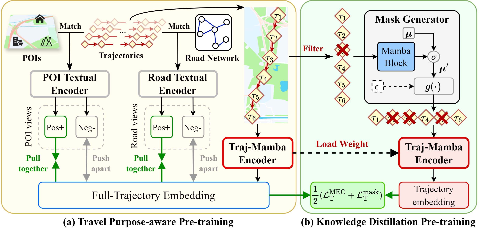
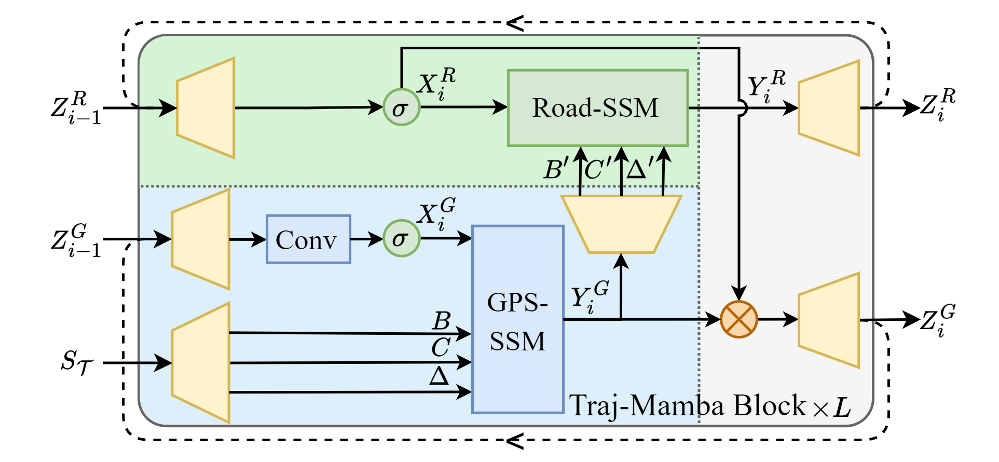

# TrajMamba: An Efficient and Semantic-rich Vehicle Trajectory Pre-training Model

Implementation code of the *Trajectory Mamba* (**TrajMamba**) model.

## Requirement
We build this project by Python 3.9.12 with the following packages:
```
torch==2.1.2
mamba-ssm==2.2.4
causal-conv1d==1.4.0
triton==2.1.0
numpy==1.24.1
pandas==1.5.3
```

## Hands-on

Preprocess data for experiments:

```bash
python data.py -s local_test_search;
```

Set OS env parameters:

```bash
export SETTINGS_CACHE_DIR=/dir/to/cache/setting/files;
export MODEL_CACHE_DIR=/dir/to/cache/model/parameters;
export PRED_SAVE_DIR=/dir/to/save/predictions;
```

Run the main script:

```bash
python main.py -s local_test;
```

## Model Structure

The overall framework of TrajMamba. Its pipeline is implemented in the following three steps: 
- Given a trajectory $\mathcal{T}$, we introduce a Traj-Mamba Encoder to generate its embedding vector to effectively capture movement patterns. 
- To efficiently perceive travel purposes, we develop Travel Purpose-aware Pre-training to train the Traj-Mamba encoder by aligning the learned embedding with the road and POI views of $\mathcal{T}$, which encode the travel purpose through road and POI textual encoders. After this pre-training, we fix the weights of the encoder and regard it as the teacher model for the next step. 
- To effectively reduce redundancy in $\mathcal{T}$, we apply the Knowledge Distillation Pre-training. It employs a learnable mask generator to identify key trajectory points in $\mathcal{T}$ for compression, then aligns the compressed representation from a teacher-initialized Traj-Mamba encoder with the full-trajectory embedding from the teacher model.



The Traj-Mamba Encoder consisting of $L$ stacked *Traj-Mamba blocks* inspired by the Mamba2 structure. Each block employs two multi-input selective SSMs, namely GPS-SSM and Road-SSM, to capture long-term spatiotemporal correlations in input trajectories with linear time complexity.



## Technical Structure

The data preprocessing settings are controlled by a JSON configuration file. `settings/local_test_search.json` provides an example.

The parameters and experimental settings are controlled by a JSON configuration file. `settings/local_test.json` provides an example.

The `sample` directory contains subsets of the Chengdu and Xian datasets for reference and quick debugging. The full datasets have the same file format and fields.
